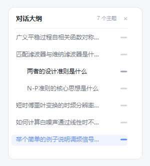

<div align="center">

# dsh-conversation-toc

[**中文**](./README.zh.md) | English

[GitHub](https://github.com/twelvecarbon/dsh-conversation-toc) · [npm](https://www.npmjs.com/package/dsh-conversation-toc) · MIT License

**Conversation outline for DeepSeek Harness Web** — a right-side topic sidebar (TOC) like the DeepSeek web app, with scroll-spy highlighting and click-to-jump navigation.


</div>

---

## Overview

dsh-conversation-toc is a **browser-side** plugin for **DeepSeek Harness Web**. After installation, an **「Outline」** button appears on the right side of the session header, and a **conversation outline panel** (or a collapsed **minimap rail**) floats on the right of the chat — the same reading experience as the DeepSeek web app's right sidebar:

- **Topic list** — every user question is a top-level topic, `steering` follow-ups are indented sub-topics, and `##` / `###` headings inside assistant answers become third-level topics, so you can jump into any section of a long answer;
- **Scroll-spy** — the outline highlights the topic you are currently reading as you scroll;
- **Jump navigation** — click any topic to smooth-scroll to the corresponding message;
- **Minimap rail** — when there isn't enough room (or you collapse it manually), only the capsule indicator rail stays on the right; click a capsule to jump, hover to preview the topic text.

> Works on **Windows / macOS / Linux** — everything runs in the browser: no host service, no settings page, no platform-specific code.

## Screenshots

### Expanded outline panel


### Collapsed minimap rail


## Features

- **Three display modes**, cycled by the header「Outline」button: `expanded panel → minimap rail → hidden`; the choice is remembered in `localStorage`.
- **Hierarchical topics**: user question (level 1) → `steering` follow-up (level 2, indented) → assistant answer headings `##` / `###` (level 3).
- **Scroll-spy highlight**: the current reading position is tracked against the real chat scrollport and highlighted in blue; when scrolled to the bottom, the last topic is highlighted.
- **Jump-to-section**: reuses the core chat anchors (`[data-chat-anchor-key]` / `[data-conversation-scroll]`) — no private stylesheets, resilient across DSH updates.
- **Adaptive layout**: the expanded panel floats in the whitespace to the right of the message column; when there isn't enough room it automatically falls back to the minimap rail, and it never overlaps the right "details" panel.
- **Theme-aware**: uses DSH theme tokens, so it follows light / dark themes; typography scales with the app's display-size setting.
- **Live updates**: topics come straight from the session store (`chat.order` / `chat.nodes`), so new messages and streaming output are reflected automatically.
- **Safe by design**: no host API and no disk writes — the only persisted state is the display-mode preference in `localStorage`.

## Recommended Installation

> Either method works and is equivalent. **We recommend the one-command install.**

### Option 1 (recommended): one command

The package is not published to npm yet — install from **this GitHub repository** or from the **local tarball**:

```bash
# from GitHub (after pushing this repo)
dsh plugin --profile web add git+https://github.com/twelvecarbon/dsh-conversation-toc.git

# or from a local tarball
dsh plugin --profile web add C:\path\to\dsh-conversation-toc-0.1.1.tgz
```

Restart the dsh web service after installation.

### Option 2: manual install

Follow the detailed manual / wiring / uninstall guide below.

---

## What's in the package

One npm package = a **host half** (an empty Cordis plugin row, `lib/index.js` — the feature is purely browser-side) + a **client half** (the outline UI, `lib/client.js`).

The package integrates with DSH through two declarations:

| Declaration | Purpose |
| --- | --- |
| `dsh.bundle.patch` (`cordis.patch.yml`) | Lets DSH recognize it as a **standard bundle plugin package**: `dsh plugin --profile <name> add <package>` installs and wires it in one command, no manual config editing |
| `dsh.client` + `exports["./client"]` | Lets the web client auto-load the outline UI at `/plugins/<package>/client.js` |

So for users, **installation is one command** — no YAML editing, no manual file copying.

## Installation (for users)

### 0. Prerequisites

- DeepSeek Harness installed (`npm install -g @deepseek-ai/dsh`, a desktop app built on it, or `npx @deepseek-ai/dsh web`).
- Option 1 needs **pnpm**: `npm install -g pnpm` (or `corepack enable`).
- Make sure `dsh` is on PATH.

### 1. Method A (recommended): one command

```bash
dsh plugin --profile web add git+https://github.com/twelvecarbon/dsh-conversation-toc.git
```

This does three things (all automatic):

1. Installs the package via pnpm into `~/.dsh/profiles/web` (auto-initializes the profile on first use);
2. Detects the package's `dsh.bundle` declaration and writes the package name into the profile's `dsh.profile.bundles` layer list;
3. After restart, DSH reads the package's `cordis.patch.yml` and mounts the plugin row into the app tree — **no manual config editing**.

Same for other profiles (replace `web` with your profile name, e.g. `dsh plugin --profile headless add ...`; `dsh web` equals `dsh --profile web`).

> Test a local tarball: `dsh plugin --profile web add C:\path\to\dsh-conversation-toc-0.1.1.tgz`

### 2. Method B: manual install (no pnpm / no `dsh plugin`)

**B1. Install the dependency:**

```bash
cd ~/.dsh/profiles/web
pnpm add git+https://github.com/twelvecarbon/dsh-conversation-toc.git
# or from a local folder / tarball
# pnpm add C:\path\to\dsh-conversation-toc
```

**B2. Wire it up (once, idempotent):** append the package name to the profile's `dsh.profile.bundles` in `~/.dsh/profiles/web/package.json`:

```json
"dsh": {
  "profile": {
    "bundles": [
      "@deepseek-ai/dsh-base",
      "@deepseek-ai/dsh-web-app",
      "dsh-conversation-toc"
    ]
  }
}
```

**B3. Mount the plugin row:** append to `~/.dsh/profiles/web/cordis.patch.yml` (create it if missing):

```yaml
- insert:
    - id: conversation-toc
      name: 'dsh-conversation-toc'
```

**B4. Restart the dsh web service.**

### 3. Uninstall

```bash
dsh plugin --profile web remove dsh-conversation-toc
```

Or manually: remove the dependency, the `dsh.profile.bundles` entry, and the `cordis.patch.yml` row, then restart.

## Usage

1. Open any conversation and send / view messages;
2. The **「Outline」** button appears on the right of the session header;
3. The outline panel floats on the right of the chat: click any topic to jump to the corresponding message; the current topic highlights in blue as you scroll;
4. When there isn't enough room, the panel automatically collapses to the minimap rail; click the「Outline」button to cycle the three display modes (expanded → rail → hidden).

## How it works

- **Data source** — the browser reads the session store (`useSession` selectors over `chat.order` / `chat.nodes`), so topics stay in sync with new messages and streaming output;
- **DOM anchors** — it reuses the core `[data-chat-anchor-key]` anchors and the `[data-conversation-scroll]` scrollport, no private class names;
- **Host side** — nothing to do: `lib/index.js` is an empty host row that exists only so the package mounts as a standard DSH bundle plugin and its client bundle is discovered by the web boot graph.

## File structure

```
dsh-conversation-toc/
├── package.json                # dsh.bundle.patch + dsh.client declarations
├── cordis.patch.yml            # host plugin row (mount layer)
├── lib/
│   ├── index.js                # host half (empty — no host service)
│   └── client.js               # client half (the whole feature)
├── scripts/
│   ├── check-package.js        # pre-publish contract gate (npm run check)
│   ├── smoke-test.cjs          # pure-logic smoke tests (npm run test)
│   └── generate-screenshots.ps1  # regenerates docs/assets mockups (Windows)
├── docs/assets/                # README screenshots
├── CHANGELOG.md
├── LICENSE
├── README.md                   # English
└── README.zh.md                # 中文
```

## Changelog

See [CHANGELOG.md](./CHANGELOG.md).

## License

[MIT](./LICENSE)
